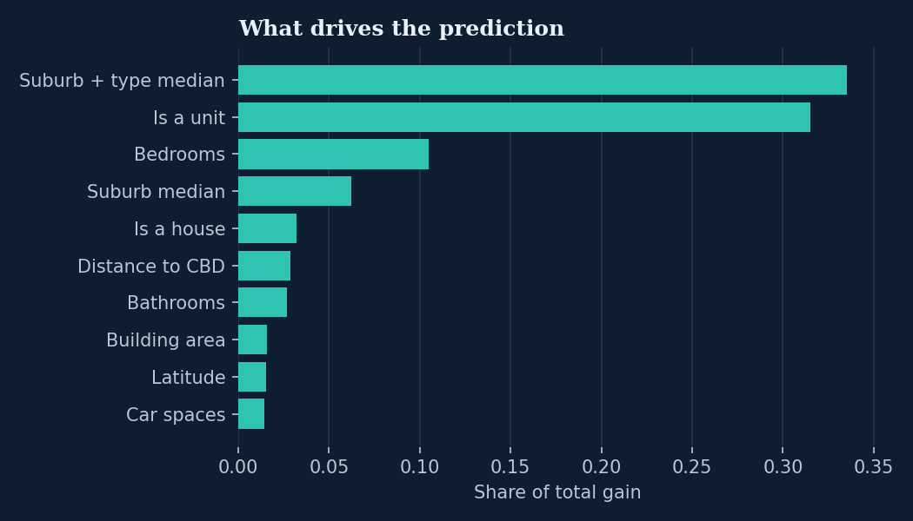

# Melbourne Property Price Predictor

Estimate what a Melbourne property would sell for, with an honest 80% price range, from the details a buyer actually knows: suburb, type, bedrooms, bathrooms, car spaces and, optionally, land size, building size and year built.

**[Try the live demo](https://property.rishabhray.me)** - it runs entirely in your browser, no server involved.



## Results

Tested the honest way: trained on sales up to October 2017, then evaluated only on **5,449 later sales (Nov 2017 to Mar 2018)** that the model never saw. Shuffled train/test splits flatter house-price models, because they let the model peek at the future market.

| | Median error | Within 10% of the sale price | Within 20% | Average error |
|---|---|---|---|---|
| Baseline: suburb + property-type median | 15.4% | 35.4% | 61.1% | $230k |
| **XGBoost model** | **10.3%** | **49.0%** | **78.1%** | **$151k** |

- The **80% price range contained the real price for 80.0%** of those future sales, so the range means what it says.
- Error by type: houses 9.8%, townhouses 10.6%, units 13.2% (units vary more on things the data does not capture, like floor and outlook).
- Full numbers in [`reports/metrics.json`](reports/metrics.json).

## How it works

1. **Data** - 34,857 Melbourne sales scraped from Domain.com.au (2016 to 2018), filtered to 27,241 residential sales with a price. Impossible values (a 0 m² house, a year built of 1196) become missing rather than something the model learns from. [`src/data/load.py`](src/data/load.py)
2. **Features** - bedrooms, bathrooms, car spaces, land and building size (log-scaled), year built, property type, distance to the CBD and coordinates, sale month, and smoothed suburb and suburb-by-type median prices. Every statistic is learned from the training period only, and small suburbs are shrunk toward the wider median so three sales do not define a suburb. Missing inputs are filled with the training median, never left for the model to guess. [`src/features/build.py`](src/features/build.py)
3. **Model** - XGBoost on log price, with early stopping on a separate calibration period (720 trees). [`src/model/train.py`](src/model/train.py)
4. **Price range** - split conformal: the range comes from the model's actual errors on the calibration period, then checked on the test period.
5. **Browser demo** - the trees are exported to compact JSON and scored by a 20-line JavaScript evaluator ([`web/model.js`](web/model.js)). Feature building is mirrored in [`web/features.js`](web/features.js).

## Tests

```bash
python -m pytest -q
```

Eight tests cover the promises above: no missing values reach the model, unseen suburbs fall back instead of failing, small suburbs are shrunk, the split is by time, the model beats the median baseline, the price range is within 5 points of its stated coverage, and **the browser reproduces Python's features and predictions exactly** (compared with Node).

## Run it yourself

```bash
pip install -r requirements.txt
python -m src.model.train     # downloads the data with kagglehub, trains, evaluates, exports to web/
python -m pytest -q
python -m http.server 4400 --directory web   # then open http://localhost:4400
```

## What I would do differently

- **Location is only suburb-level in the demo.** The model uses each sale's own coordinates in training, but the demo can only use the suburb centre. Street-level location (or distance to the nearest station and school) would sharpen it most.
- **Prices are 2016 to 2018 dollars.** Melbourne has moved since. A current version needs recent sales data, which is not freely available at this detail.
- **The price range is one width for every property.** Units are harder to price than houses; a range that adapts per property (quantile models, or conformal by type) would be tighter where the model is confident.
- **No hyperparameter search yet.** The settings are sensible defaults with early stopping; a proper time-series cross-validated search is the next step.

## Data and licence

Data: [Melbourne Housing Market](https://www.kaggle.com/datasets/anthonypino/melbourne-housing-market) by Tony Pino, scraped from Domain.com.au, licensed **CC BY-NC-SA 4.0**. The raw data is downloaded at training time and not included in this repository. The derived model and suburb statistics in `web/` are shared under the same licence, for non-commercial use.

This is a portfolio project built on public data. It is not a valuation and should not be used as one.
